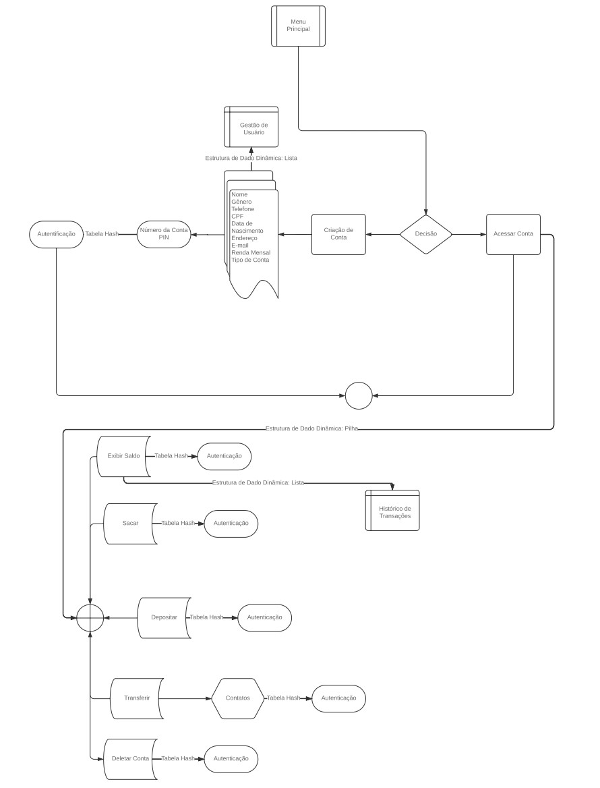

# Sistema Bancário
Sistema Bancário para gerenciamento e criações contas 

## Autores: 

- 202302570 - Matheus Teles Marques 
- 202307122 - Victor Alves Freire De Queiroz
- 202302594 - Yan Santos Leite

## Resumo

O projeto de um Sistema Bancário tem como objetivo permitir saques, depósitos, consultas de saldo e a criação de contas bancárias.
O sistema gerencia contas e transações de forma eficiente e segura, autenticando os usuários e verificando saldos antes de realizar 
qualquer operação. A criação de novas contas é integrada ao processo, permitindo o registro de usuários de forma simples. Além disso,
o sistema é projetado para ser modular, facilitando a manutenção e a implementação de novas funcionalidades, como transferências,
consulta de extratos e outras opções.

### Palavras-chave: 
Sistema Bancário, Otimização , modularização, Transações e Segurança; 

## Introdução

### Problema
Os sistemas bancários desempenham um papel fundamental ao permitir que os clientes realizem operações financeiras de forma rápida e prática, como saques, depósitos, transferências e consultas. No entanto, esses sistemas ainda hoje enfrentam desafios relacionados à segurança, eficiência e necessidade de manutenção constante.Nesse contexto,sistemas que garantam maior proteção, adotando tecnologias de segurança e métodos de autenticação adequados, e que melhorem a velocidade das transações, investindo também em manutenção preventiva devem “ser a regra”.

### Literatura

* Estruturas de Dados e Seus Algoritmos - Jayme Luiz Szwarcfiter e Lilian Markenzon

### Dataset

O dataset utilizado no projeto contém informações fornecidas pelos clientes no momento do cadastro (criação da conta), incluindo dados como nome, telefone, CPF, e-mail, gênero, data de nascimento, tipo de conta, saldo, endereço e renda mensal.

### Métodos

O sistema bancário utiliza conceitos de estrutura de dados e algoritmos na linguagem C garantindo assim uma maior performance, necessária para processar grandes volumes de transações simultaneamente,além de fornecer um nível de controle maior,o que é útil para sistemas bancários que precisam ser otimizados e protegidos contra falhas de segurança como gerenciamento inadequado de memória.
Structs: Permitem agrupar diferentes tipos de dados sob uma única entidade. Modelo de conta: Uma Struct pode armazenar informações detalhadas de uma conta, como número da conta, titular, saldo e PIN. Transações: Outra Struct pode representar as transações, incluindo tipo (saque, depósito), valor e data;

* Listas Ligadas (Linked Lists) :
Uma estrutura de dados dinâmica onde cada elemento (nó) aponta para o próximo. Histórico de transações: Usar uma lista ligada permite que o histórico cresça ou diminua dinamicamente sem necessidade de redimensionar arrays. Gestão de usuários: Para sistemas com muitos usuários, uma lista ligada facilita adicionar, remover e pesquisar informações;

* Pilhas (Stacks):
Estruturas que seguem o princípio LIFO (Last In, First Out). Navegação no menu: Implementar a navegação entre diferentes opções do menu do caixa eletrônico. Desfazer operações: Guardar o estado anterior de transações em uma pilha para possibilitar desfazer a última ação;

* Hash Tables:
Estruturas que armazenam dados em pares chave-valor para acesso rápido. Aplicação no sistema: Autenticação: Gerenciar login e autenticação por meio de hash tables, onde a chave é o número da conta e o valor é o PIN. Mapeamento de contas: Associar rapidamente números de conta a seus respectivos registros;

### Avaliação:

Os critérios utilizados para avaliar serão:
   * Tempo de Execução;
   * Uso de Memória; 
   * Nível de manutenção e modularidade:

## Fundamentos Teóricos

Será feito futuramente!!!

## Metodologia

Para o  desenvolvimento do sistema bancário foram seguidos os seguintes passos:

### Planejamento:

Essa etapa  consistiu da análise do funcionamento de Sistemas Bancários, onde foram identificadas as seguintes funcionalidades essenciais:
Criação e acesso a conta;
Saque, depósito e transferências;

### Implementação:

* Tela de Menu e Opções: A tela de menu inicial apresenta as opções de cadastro de conta e acesso a conta (caso a conta já esteja ativa no sistema);

* Cadastro de Conta: Ao selecionar a opção de cadastro de conta, o usuário informa seus dados pessoais, especifica o tipo de conta a ser criada e a quantia que deseja abrir na conta;
Esses dados são armazenados em uma struct;

* Geração de Número de Conta e PIN:

Após o cadastro, o número da conta e o PIN do usuário são gerados por meio de um algoritmo de randomização;
Acesso à Conta: O usuário tem a opção de acessar sua conta;
Para isso, passa por uma etapa de autenticação utilizando uma tabela hash que mapeia o número da conta ao seu registro;

* Operações na Conta:

Após a autenticação, o usuário pode realizar as seguintes operações:

 * Depósito;
 * Saque;
 * Transferência;
 * Consultar saldo;

* Exclusão de Conta:
O usuário também tem a opção de deletar a conta, caso deseje;

* Estrutura de Dados do Sistema:
A atualização do conjunto de usuários do sistema será feita utilizando listas;
As listas também serão responsáveis por manter o histórico de transações de cada usuário;

* Navegação e Desfazer Operações:
A navegação pelos menus e a funcionalidade de desfazer operações serão implementadas utilizando pilhas;

### Testes:

* Gerenciamento de contas:

Garantir que as contas bancárias sejam localizadas de forma rápida e eficiente, com tratamento adequado de possíveis colisões de dados;

* Processamento de transações:

Assegurar que as transações como saques e depósitos sejam realizadas na ordem correta, processando primeiro as mais antigas.

* Armazenamento de informações de conta:

Validar que os dados da conta bancária sejam armazenados corretamente e possam ser acessados facilmente;

* Gestão de transações reversíveis:

Garantir que transações que precisam ser desfeitas, como estornos, sejam revertidas corretamente na ordem inversa;
Histórico de transações: Assegurar que o histórico de transações seja registrado corretamente e possa ser consultado de forma eficiente;

## Fluxograma: 

Segue o Fluxograma do projeto: 

