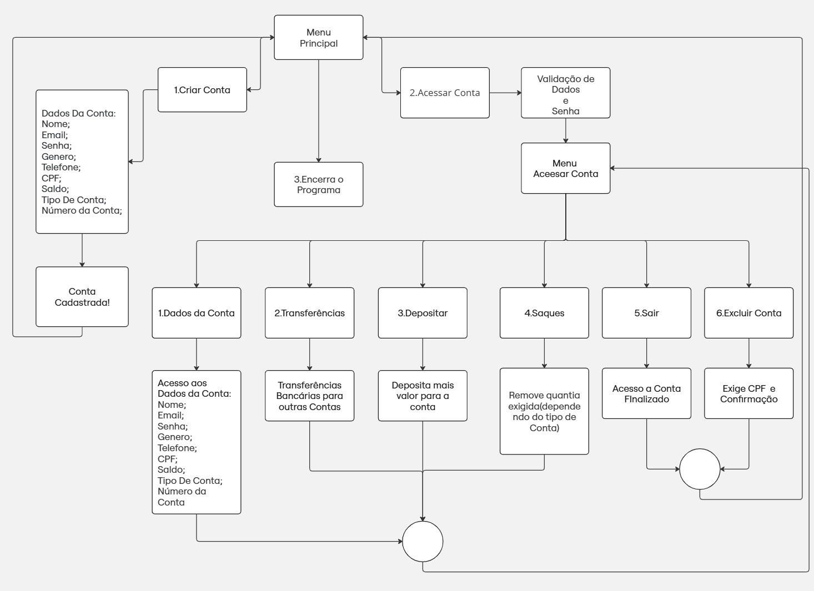
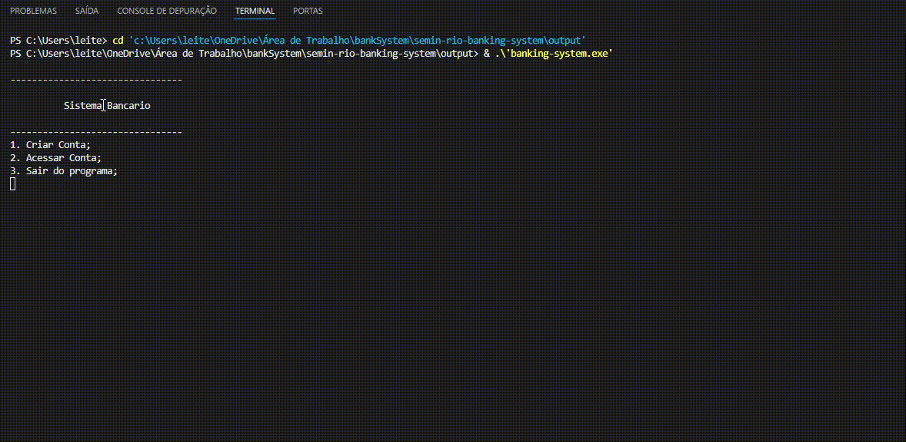

# Sistema Bancário
Sistema Bancário para gerenciamento e criações contas 

## Autores: 

- 202302570 - Matheus Teles Marques 
- 202307122 - Victor Alves Freire De Queiroz
- 202302594 - Yan Santos Leite

## Resumo

O projeto do Sistema Bancário busca simular as principais funcionalidades de um aplicativo moderno de bancos, permitindo saques, depósitos,transferências entre contas, consultas de saldo, criação e exclusão de contas bancárias.

### Palavras-chave: 
Sistema Bancário, Listas, memória dinâmica , Transações e Segurança; 

## Introdução

### Problema
Os sistemas bancários desempenham um papel fundamental ao permitir que os clientes realizem operações financeiras de forma rápida e prática. No entanto, esses sistemas ainda hoje enfrentam desafios relacionados à segurança, eficiência e necessidade de manutenção constante.Nesse contexto,sistemas que garantam maior proteção ao usuário, adotando tecnologias de segurança e métodos de autenticação adequados, e que melhorem a velocidade das transações devem ser implementados.

### Dataset

O dataset utilizado no projeto contém informações fornecidas pelos clientes no momento do cadastro (criação da conta), incluindo dados como nome, telefone, CPF, e-mail, gênero, tipo de conta, saldo, senha e um número de conta gerado automaticamente e aleatoriamente na hora do cadastro da conta.

### Métodos

O projeto desenvolvido utiliza conceitos de estrutura de dados, ponteiros e algoritmos na linguagem C garantindo assim uma maior performance e um nível de controle maior,o que é útil para os sistemas bancários que precisam ser otimizados e protegidos contra falhas de segurança e o gerenciamento inadequado de memória.

### Avaliação:

Os critérios utilizados para avaliar serão:
   * Tempo de Execução;
   * Uso de Memória; 
   * Nível de manutenção e modularidade;

## Fundamentos Teóricos

O sistema desenvolvido buscou soluções para os problemas expostos anteriormente.Para se alcançar esse fim, era necessário utilizar alguma estrutura de dados elementar que pudesse satisfazer as necessidades principais de um sistema bancário moderno e simular suas principais funcionalidades.Dessa forma,a escolha feita foi pelas listas encadeadas.A seguir uma breve explicação teórica do que são esse tipo de listas:

* Listas Encadeadas (Linked Lists) :
Uma lista ligada(encadeada) é uma estrutura de dados na qual os objetos estão organizados em ordem linear, ordem essa determinada por um ponteiro em cada objeto.Além disso,as listas ligadas nos dão uma representação simples e flexível para conjuntos dinâmicos, suportando todas as operações que aparecem na lista. 

A escolha pelas listas foi bem natural justamente por se tratar de uma estrutura altamente prática e flexível, atingiu diversos setores do projeto e forneceu as ferramentas para desenvolver as funcionalidades centrais do sistema.

Na optica da avaliação, o sistema será avaliado pelas seguintes técnicas:

* Tempo de Resposta:
Mede a rapidez em processar operações críticas, como saques, depósitos e consultas, garantindo uma experiência ágil para os usuários.
* Uso de Memória:
Avalia a eficiência no consumo de recursos, priorizando a otimização para gerenciar grandes volumes de contas e transações.
* Escalabilidade:
Analisa como o sistema se comporta à medida que cresce o número de usuários e transações, assegurando estabilidade e eficiência.

* Testes de Performance:
Medem o tempo de execução e o uso de recursos sob condições normais de operação.

Assim, a fim de obter feedbacks que possam nortear as próximas versões e consequentemente permitir um melhor desenvolvimento da aplicação, proporcionando uma melhor experiência aos usuários, os testes tem uma grande importância dentro do projeto.

## Metodologia

Para o  desenvolvimento do sistema bancário foram feitos os seguintes passos:

### Planejamento:

Essa etapa  consistiu da análise do funcionamento de Sistemas Bancários, onde foram identificadas as seguintes funcionalidades essenciais:
* Criação e acesso à conta;
* Saque, depósito, transferências, deleção de contas;

### Implementação:

* Tela de Menu e Opções:

  A tela de menu inicial apresenta as opções de cadastro de conta e acesso a conta (caso a conta já esteja ativa no sistema);

* Cadastro de Conta:

  Ao selecionar a opção de cadastro de conta, o usuário informa seus dados pessoais, especifica o tipo de conta a ser criada e a quantia que deseja abrir na conta;
  Esses dados são armazenados em uma struct;

* Geração de Número de Conta e PIN:

  Após o cadastro, o número da conta do usuário é gerado por meio de um algoritmo de randomização;
  
* Acesso à Conta:

  O usuário tem a opção de acessar sua conta;
  Para isso, passa por uma etapa de autenticação utilizando a funcionalidade de busca das listas, que utiliza o CPF e senha do usuário para validar sua entrada no      sistema;

* Operações na Conta:

Após a autenticação, o usuário pode realizar as seguintes operações:Depósito; Saque; Transferência; Consultar saldo;

* Exclusão de Conta:

  O usuário também tem a opção de deletar a conta, caso deseje;

* Estrutura de Dados do Sistema:

  A atualização do conjunto de usuários do sistema será feita utilizando listas;
  
### Testes:

* Processamento de transações:

  Assegurar que as transações como saques e depósitos estejam funcionais, com suas devidas autenticações funcionando;

* Armazenamento de informações de conta:

  Validar que os dados da conta bancária sejam armazenados corretamente e possam ser acessados facilmente;

### Resultados: 
O desenvolvimento do programa utilizando listas encadeadas resultou em um sistema funcional e eficiente, capaz de gerenciar dados dinâmicos de maneira prática e estruturada. Durante os testes, ficou evidente que o programa faz um uso eficiente da memória, aproveitando as características dinâmicas das listas encadeadas, que eliminam a necessidade de pré-alocar grandes blocos de memória.

Cada elemento alocado foi liberado corretamente ao final da execução, prevenindo vazamentos de memória, o que é essencial em linguagens como C, nas quais a gestão manual da memória é obrigatória. A função responsável pela liberação percorreu toda a lista, nó a nó, garantindo que todos os recursos alocados fossem devolvidos ao sistema.

A escolha pelas listas encadeadas é respaldada teoricamente pelo renomado livro Algoritmos: Teoria e Prática, de Thomas H. Cormen, que destaca as vantagens dessa estrutura em cenários que demandam flexibilidade no uso da memória e eficiência em operações dinâmicas. A implementação também foi fundamentada em princípios discutidos em recursos confiáveis, como o portal de algoritmos do IME USP, ambos focados na aplicação prática de estruturas de dados em C.A orientação teórica fornecida pelos professores Bruna Michelly de Oliveira Silva e Aldo André Díaz Salazar foi crucial para o sucesso do projeto. As aulas e materiais disponibilizados por eles enfatizaram a importância da modularidade e do uso eficiente de estruturas dinâmicas.

### Conclusão:
Os resultados demonstraram que o programa atende plenamente aos critérios de eficiência e segurança, evidenciando sua viabilidade para aplicações práticas. O projeto destacou a importância de um planejamento cuidadoso e de uma estrutura modular, que não apenas facilita a manutenção, mas também possibilita a expansão do sistema. Além disso, reforçou o papel fundamental das listas encadeadas como uma solução flexível e eficaz para lidar com problemas que envolvam dados dinâmicos.

### Referências:
1.FEOFILOFF,Paulo.Linked lists.Disponível em:
https://www.ime.usp.br/~pf/algorithms/chapters/linked-lists.html .Acesso em: 23 nov. 2024.

2.mycodeschool.Pointers in C/C++.Disponível em:
https://youtube.com/playlist?list=PL2_aWCzGMAwLZp6LMUKI3cc7pgGsasm2_&si=D4x8J2d9NotG66ab .Acesso em: 19 nov. 2024.

3.CORMEN, T. H.; LEISERSON, C. E.; RIVEST, R. L.; STEIN, C. Algoritmos: Teoria e Prática. Tradução de Arlete Simille. 11. tiragem. São Paulo: Elsevier, 2012.

### Apêndices:

## Apêndice A - Diagrama de bloco que ajuda a entender o funcionamento do sistema

## Apência B - Execução de Testes

